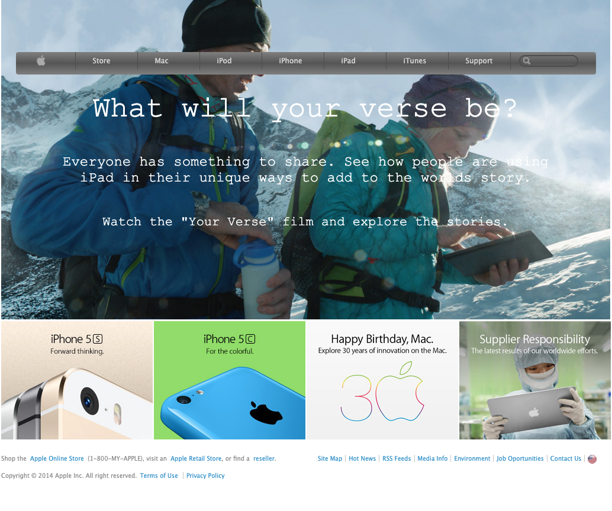

# Apple Page Clone.

The website is a clone of Apple Old Site, this a PR for understand and practice how to use gradient and background image.

## Built With

- HTML.
- CSS.

## Live Demo

[Live Demo Link](https://rawcdn.githack.com/JasemDuncan/appleWebsite/e1e32b0e41e08d8dca6ffb0f401bd9ab1bc5d661/index.html)

## Author

👤 **Jasem Duncan Valencia Vargas**

- Mail:[jasemvalencia@gmail.com]()
- Github: [@githubhandle](https://github.com/JasemDuncan)
- Twitter: [@twitterhandle](https://twitter.com/JasemValencia)
- Linkedin: [@linkedin](www.linkedin.com/in/Jasem-Duncan-Valencia)

## Show your support

Give a ⭐️ if you like this project!

